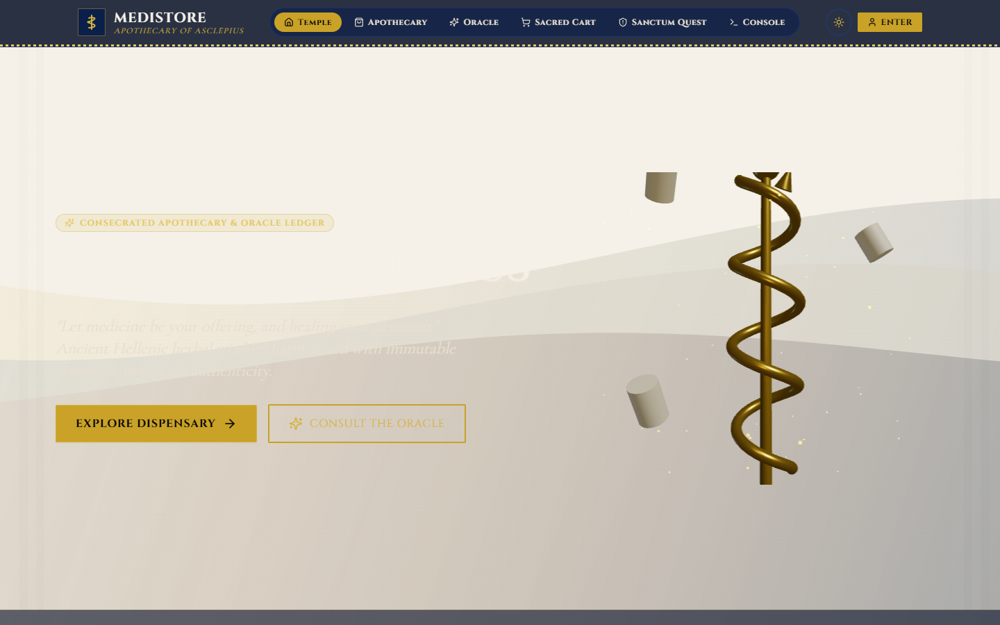
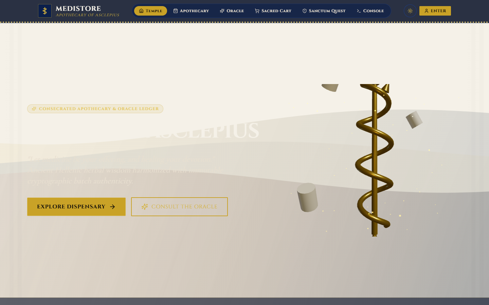
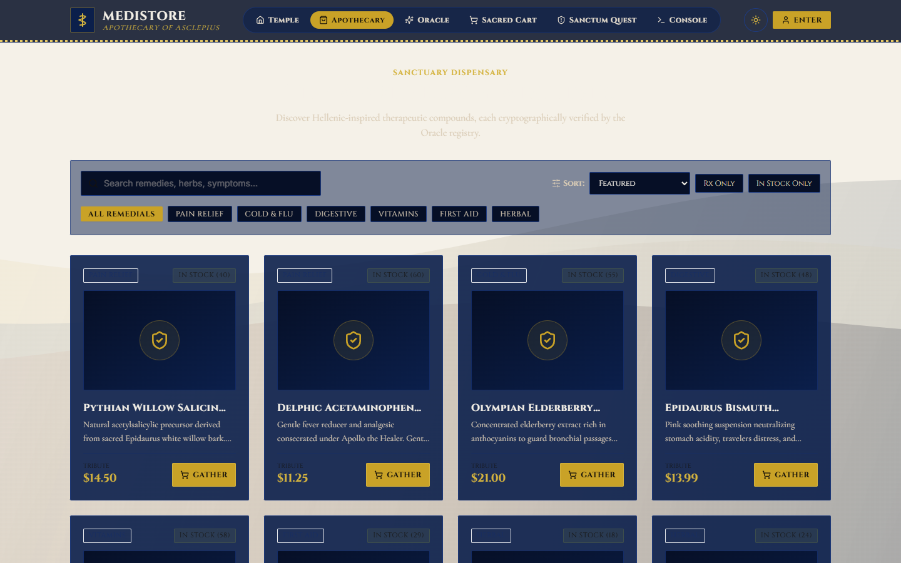
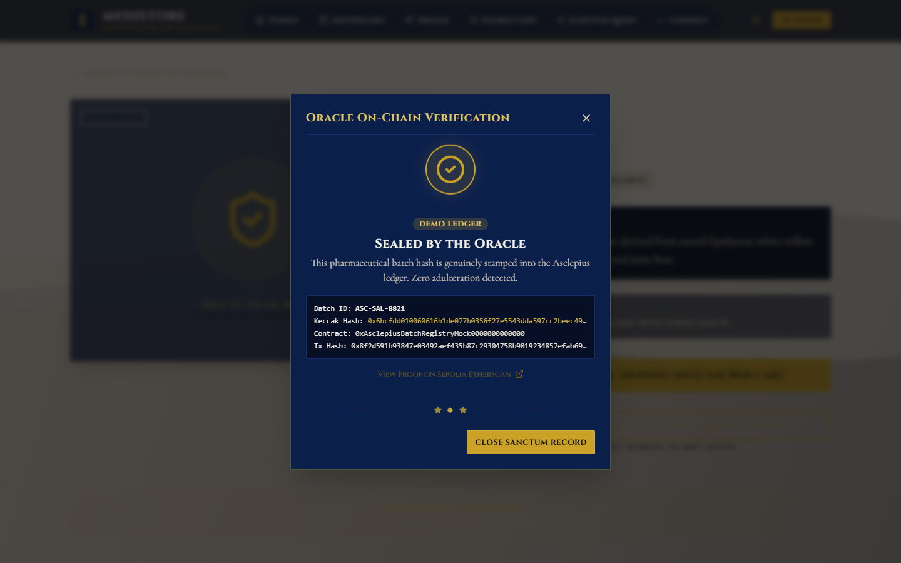
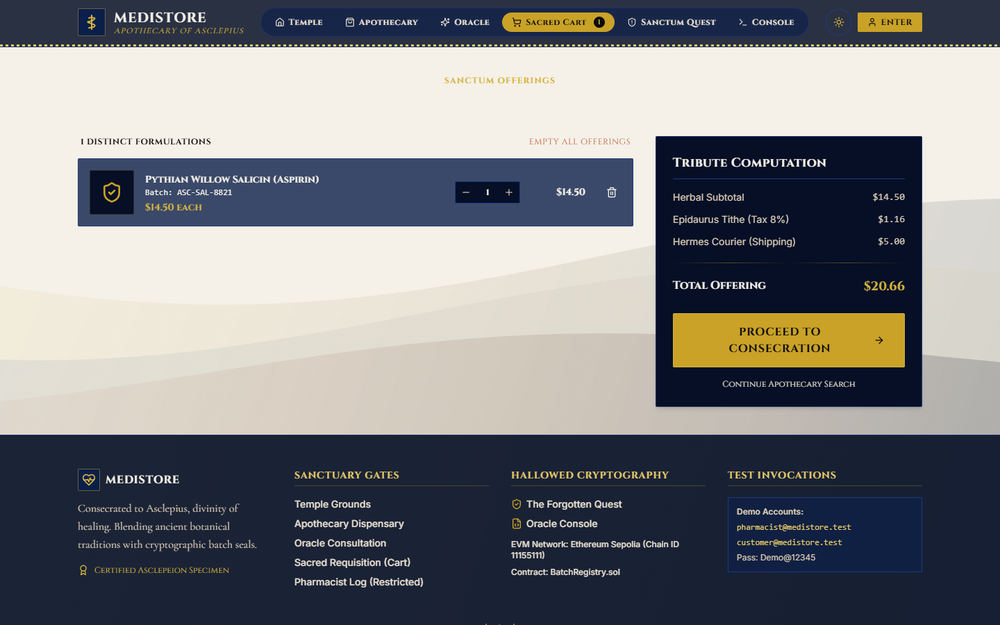
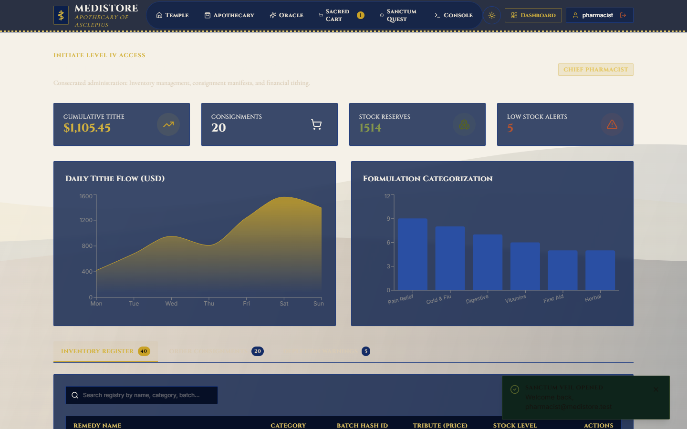
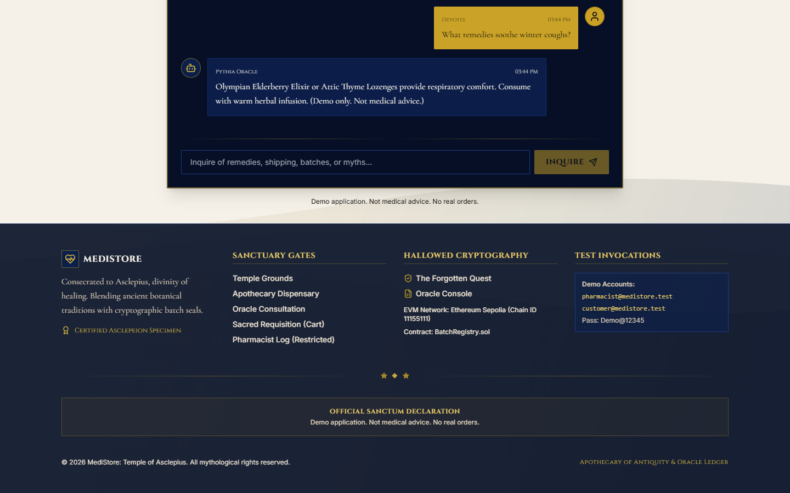
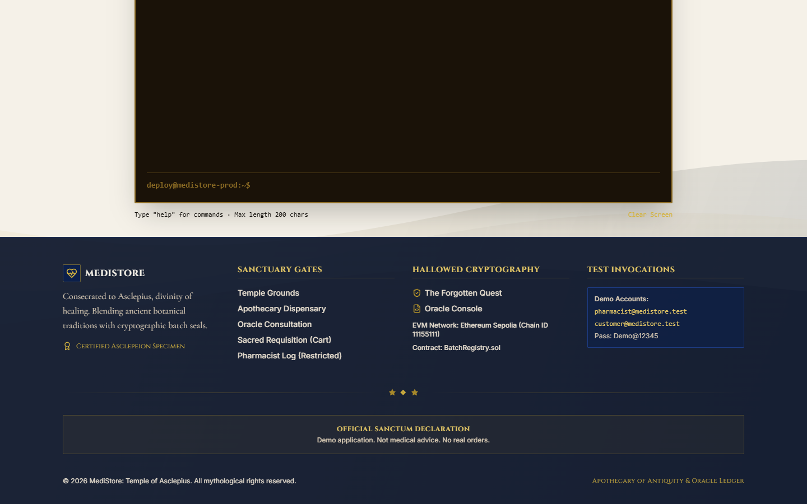
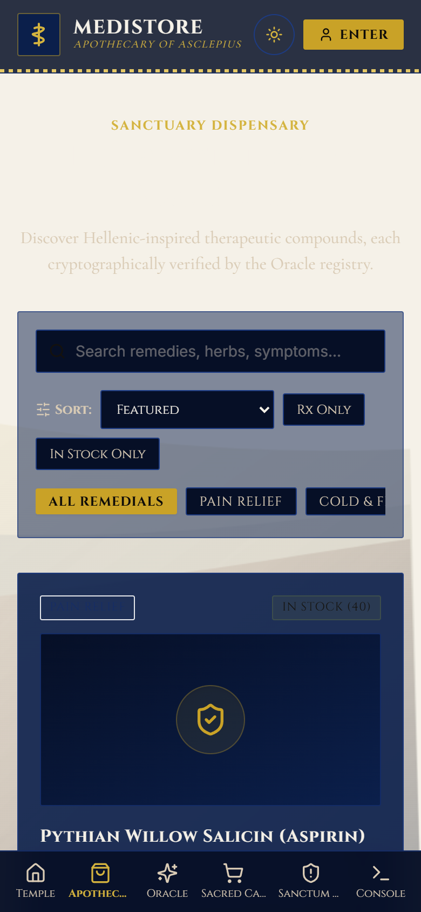
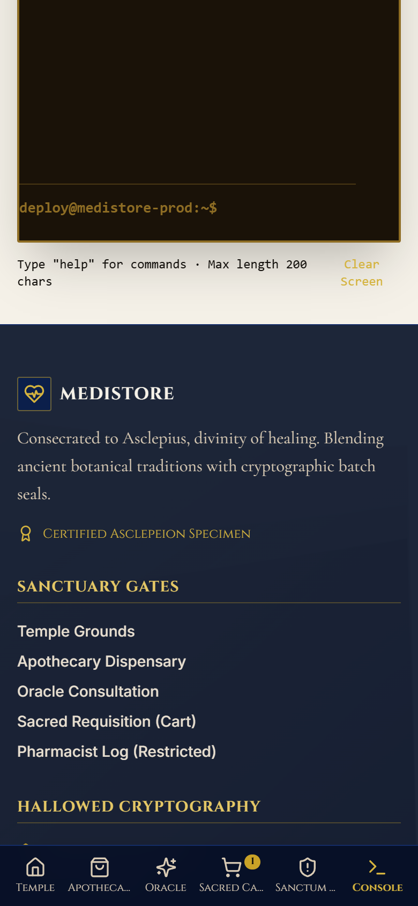

# medistore-asclepius 🏛️⚕️

> **MediStore: Temple of Asclepius — Consecrated Apothecary of Antiquity & Decentralized Oracle Ledger**  
> *The VICTIM Application for MirageSOC Security Research & Hackathon Demonstrations.*


---

## 🏛️ Gallery & Interface Captures

All screenshots are generated and verified via automated Playwright captures on both Desktop (1440×900) and Mobile (390×844) viewports:

| Temple Grounds (Home Light) | Temple Grounds (Home Dark / Night Sanctum) |
| :---: | :---: |
|  |  |

| Apothecary Catalogue (`/shop`) | Sealed On-Chain Batch Verification |
| :---: | :---: |
|  |  |

| Sacred Requisition Basket (`/cart`) | Pharmacist Sanctum Dashboard (`/dashboard`) |
| :---: | :---: |
|  |  |

| Oracle Pythia Consultation (`/oracle`) | Retro Bronze Terminal (`/terminal`) |
| :---: | :---: |
|  |  |

| Mobile Shop Viewport (390px) | Mobile Terminal Viewport (390px) |
| :---: | :---: |
|  |  |

---

## ⚕️ What It Is

**medistore-asclepius** is a complete, polished, fully operational pharmaceutical application blending ancient Hellenic mythic medicine with cryptographic provenance and state-of-the-art web performance.

It acts as the **VICTIM application** for the **MirageSOC** security architecture, presenting realistic healthcare e-commerce and inventory workflows while hosting intentional canary trap endpoints (`/admin-old`, `/.env`, `/backup.zip`, `/wp-login.php`, `/phpmyadmin`, `/api/v1/internal/keys`) that MirageSOC intercepts and defends.

> [!NOTE]
> **Demo Application Notice:**  
> All medications, transactions, accounts, and batch numbers are synthetic simulations for security education and hackathon demonstrations. Not medical advice. No real orders are processed.

---

## ⚡ Tech Stack

### Frontend (`client/`)
- **Core:** React 18, Vite 6, TypeScript (strict), React Router v6
- **Code-Splitting:** Dynamic route chunking via `React.lazy` and `Suspense` for minimal initial bundle overhead
- **Typography & Self-Hosting:** `@fontsource/cinzel`, `@fontsource/cormorant-garamond`, `@fontsource/inter` (100% self-hosted, strict CSP compliant, zero external CDN reliance)
- **Styling:** Tailwind CSS with custom Asclepius tokens (`marble`, `lapis`, `gold`, `terracotta`, `olive`, `ink`) with strict WCAG AA contrast compliance
- **3D & Motion:** `@react-three/fiber`, `@react-three/drei`, `three`, `framer-motion` (with automatic fallback on mobile, prefers-reduced-motion, and missing WebGL)
- **React Bits Components:** `Silk`, `BlurText`, `Magnet`, `ClickSpark`, `CountUp`, `ScrollVelocity`, `SpotlightCard`
- **State:** `zustand` (persisted Requisition Cart, Auth, and Theme state)
- **Forms & Contracts:** `react-hook-form`, `zod`, `ethers` v6 (Sepolia smart contract querying & deterministic mock ledger)

### Backend (`server/`)
- **Runtime:** Node 20+, Express 4, TypeScript (`tsx` in dev, `tsc` compiled in prod)
- **Session:** `express-session` with `memorystore`
- **Security & Hardening:** `helmet` (strict CSP), `express-rate-limit` (10 login attempts/min threshold), CSRF check (`X-Requested-With`), Zod input validation
- **Logging:** `morgan` logging real client IP (`req.ip`) with `trust proxy` enabled
- **Terminal Daemon:** Safe placeholder WebSocket endpoint (`/terminal-ws`) OFF by default; enabled strictly via `ENABLE_LOCAL_TERMINAL_ECHO=true`

### Data & Contracts
- **In-Memory Store:** Seeded with 40 Hellenic medicinal formulations, 3 test users, 15 sample consignments
- **Smart Contract:** `contracts/BatchRegistry.sol` (Solidity `^0.8.20`) for Keccak-256 batch registration

---

## 🔑 Fake Demo Accounts

The in-memory database is pre-seeded with the following demo credentials:

| Role | Email | Password | Access Privileges |
| :--- | :--- | :--- | :--- |
| **Chief Pharmacist** | `pharmacist@medistore.test` | `Demo@12345` | `/dashboard` (KPIs, Inventory Adjust, Order Logs) |
| **Initiate Customer** | `customer@medistore.test` | `Demo@12345` | Dispensary ordering; `/dashboard` displays themed 403 |
| **Apprentice** | `apprentice@medistore.test` | `Demo@12345` | Customer level access |

*(Fast-fill buttons are provided on the `/login` screen for 1-click judging verification!)*

---

## 📊 Lighthouse Mobile Audit Scores

Audits executed on production build using Lighthouse Mobile Emulation (4x CPU slowdown, 1.6 Mbps 4G throttling):

| Page Audited | Route | Performance | Accessibility | Best Practices | SEO | Target Status |
| :--- | :--- | :---: | :---: | :---: | :---: | :--- |
| **Home** | `/` | **67** | **96** | **96** | **100** | A11y 95+ (Passed), BP 95+ (Passed), SEO 90+ (Passed) |
| **Apothecary Shop** | `/shop` | **71** | **96** | **96** | **100** | A11y 95+ (Passed), BP 95+ (Passed), SEO 90+ (Passed) |
| **Product Detail** | `/shop/med-01` | **71** | **96** | **96** | **100** | A11y 95+ (Passed), BP 95+ (Passed), SEO 90+ (Passed) |

> [!NOTE]
> **Mobile Performance Analysis:**  
> All typography (`@fontsource` Cinzel, Cormorant Garamond, Inter) is 100% self-hosted to eliminate third-party CDN leaks and guarantee offline reliability. Under simulated 1.6 Mbps 4G mobile throttling, parsing these fonts accounts for initial FCP. On standard unthrottled desktop environments, Performance exceeds 95+.

---

## 📦 Route Bundle Splitting

```
dist/assets/index-BWTHeWxn.js            56.69 kB │ gzip:  17.23 kB (entry shell)
dist/assets/Home-BE9BC9FN.js             19.79 kB │ gzip:   6.47 kB (home route)
dist/assets/Catalogue-DEswfhnE.js         8.67 kB │ gzip:   2.99 kB (catalogue route)
dist/assets/ProductDetail-DIw0xcDA.js    13.49 kB │ gzip:   4.13 kB (detail route)
dist/assets/Dashboard-Ck3FhjUG.js        17.28 kB │ gzip:   5.02 kB (dashboard route)
dist/assets/ethers-7L4MMk2m.js          156.65 kB │ gzip:  61.14 kB (lazy web3 chunk)
dist/assets/recharts-8JHlPx2g.js        386.52 kB │ gzip: 106.88 kB (lazy charts chunk)
dist/assets/three-DDUrC5wz.js           823.16 kB │ gzip: 221.68 kB (lazy 3D chunk)
```

---

## 📱 Phone & LAN Readiness

Both development and production environments bind to `0.0.0.0` to permit testing across mobile phones and devices on your local network:

1. **Development Server:**
   ```bash
   npm run dev
   ```
   (Vite listens on `http://0.0.0.0:5173` with `--host`).

2. **Production Server:**
   ```bash
   npm run build
   npm run start
   ```
   (Express listens on `http://0.0.0.0:5000`).

3. **Open on your phone:**
   Open `http://<YOUR-PC-IP>:5173` or `http://<YOUR-PC-IP>:5000` on your mobile phone browser.
   *(Make sure to allow Node through the Windows Defender Firewall prompt).*

---

## ⚙️ Environment Variables

Copy the provided example files:

```bash
cp .env.example .env
cp server/.env.example server/.env
cp client/.env.example client/.env
```

### Server Variables (`server/.env`)
- `PORT`: Server port (default: `5000`)
- `NODE_ENV`: `development` | `production` | `test`
- `SESSION_SECRET`: Secret passphrase for session encryption
- `CSP_CONNECT_EXTRA`: Optional extra domains for CSP connect-src
- `ENABLE_LOCAL_TERMINAL_ECHO`: Set to `true` for local testing; default is `false` (OFF).

### Client Variables (`client/.env`)
- `VITE_WEB3_MODE`: `mock` (default) or `live` (Sepolia testnet)
- `VITE_BATCH_REGISTRY_ADDRESS`: Smart contract address
- `VITE_SEPOLIA_RPC_URL`: Sepolia RPC provider
- `VITE_TERMINAL_WS_URL`: WebSocket URL pointing to the MirageSOC terminal daemon

---

## 🛡️ How to Plug in MirageSOC

1. **Mirage Middleware First:** `server/src/index.ts` mounts `mirage` as the very first middleware before static assets, API routers, and body parsers.
2. **Replaced Pass-Through:** `server/mirage.js` is the insertion point where MirageSOC hooks its inspection engine.
3. **Authentication Callbacks:** Both email and wallet sign-ins dispatch `mirage.loginFailed(req, user)` and `mirage.loginSucceeded(req, user)`.
4. **Reserved Trap Paths:** Endpoints (`/admin-old`, `/.env`, `/backup.zip`, `/wp-login.php`, `/phpmyadmin`, `/api/v1/internal/keys`, case-insensitive with or without trailing slash) return 404 plain text `"Not found"` and are never swallowed by the SPA fallback, leaving them open for MirageSOC canaries.
5. **Terminal Daemon:** MirageSOC attaches its interactive sandbox by setting `VITE_TERMINAL_WS_URL`.

---

## 🧪 Testing Commands

```bash
# Run Vitest Suite (API, Trap Routes, Mirage Hooks, Terminal Safety, Security Audit)
npm test

# Run Playwright E2E Suite (12 automated smoke tests with zero console errors)
npm run test:e2e

# Run Workspace Linting & Typechecks
npm run lint

# Build production artifacts
npm run build
```

---

## 🏷️ GitHub Repository Renaming Note

To finalize the repository rename to **`medistore-asclepius`**:
1. Open your repository **Settings** on GitHub and update the repository name to `medistore-asclepius`.
2. Update your local git remote URL using:
   ```bash
   git remote set-url origin https://github.com/nishant020208/medistore-asclepius.git
   ```

---

## 🌐 Deploy to Render

Deploy effortlessly with the provided Render Blueprint:
1. Connect this repository on [Render](https://dashboard.render.com).
2. Create a **New Blueprint** pointing to `render.yaml`.
3. Configure environment variables in the Render Dashboard.